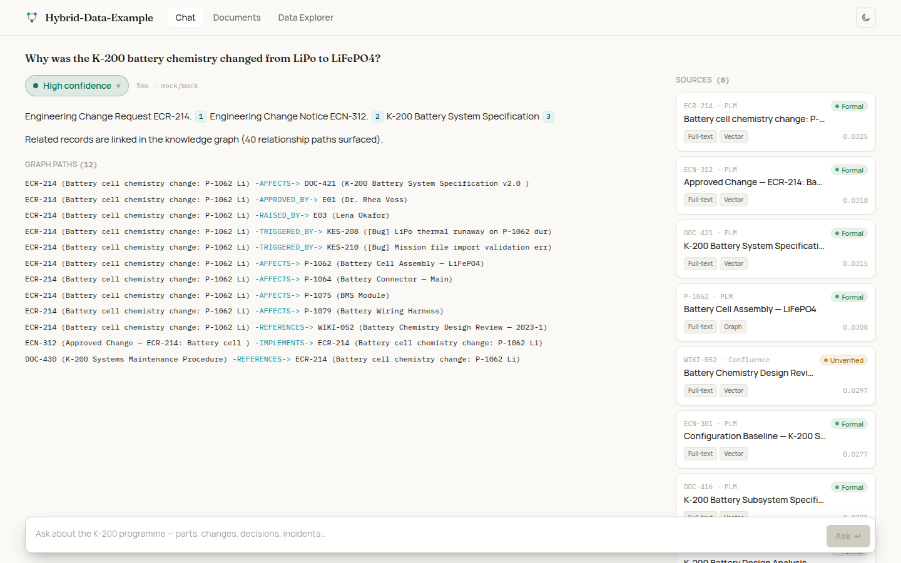
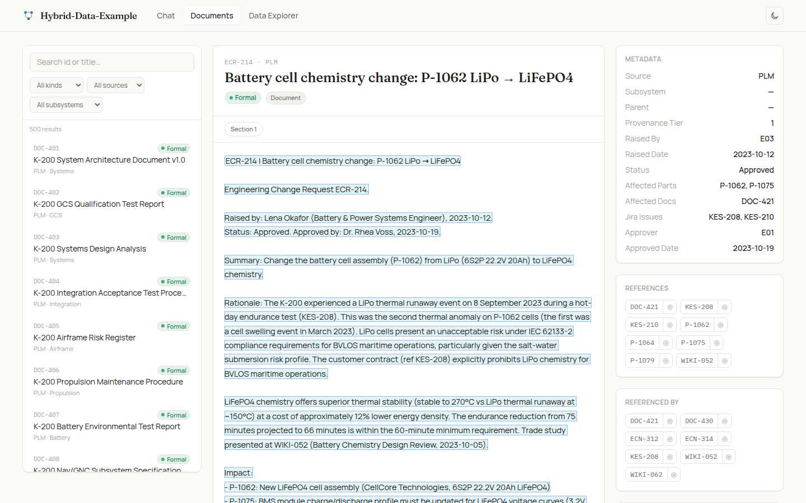
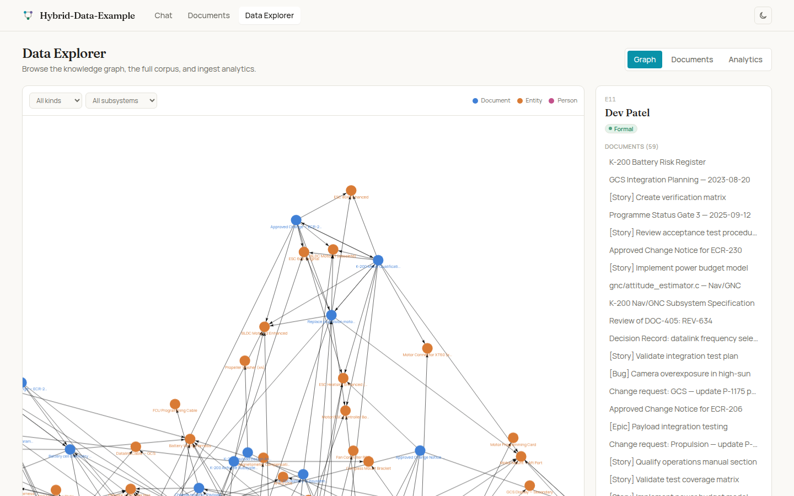

# Hybrid-Data-Example

A gold-standard reference implementation of a **hybrid RAG + knowledge-graph**
document-intelligence system: ask natural-language questions across a
heterogeneous corpus (specifications, change notices, tickets, wiki notes,
drawings, source) and get answers with **first-class citations**, a **confidence
signal you can trust**, and an honest **"not in the corpus"** when the answer
isn't there.

Everything runs from **one SQLite file** with **no external services** and **no
GPU required** for the demo. Point it at your own data by writing a small adapter.



## Why it exists

Plain vector RAG misses exact ids and struggles with "what depends on X"
questions; pure agent loops are slow and brittle on small models; pure graph
systems are weak at open-ended lookup. This project implements the design that won
a six-model, eight-architecture bake-off on this class of problem by fusing their
strengths:

- **Fused retrieval** — vector + BM25 + a knowledge-graph hop, combined with
  reciprocal-rank fusion. ~2:1 better citation grounding than plain vector RAG.
- **Hierarchical knowledge graph** — built from *structured* hierarchy (a
  parts/assembly tree), with documents hung off the entities they describe. Impact
  and dependency questions are answered by **graph traversal**, not LLM guesswork.
- **Deterministic confidence gate** — the answer / borderline / decline decision
  is computed from retrieval maths, never from the model judging itself. The gate's
  numbers are shown in the UI as the confidence display.
- **Citations resolved to the exact passage** — every cited id opens the precise
  span of source text that grounded the claim.

See [`docs/architecture.md`](docs/architecture.md) for the full design and a
pipeline diagram.

## Quickstart

```bash
git clone <this repo> && cd hybrid-data-example
make demo
```

`make demo` creates a virtualenv, installs the backend, ingests the bundled demo
corpus (offline, ~1s), and starts the API on `:8000` and the frontend on `:5173`.
Open <http://localhost:5173>.

Prefer to drive it from the terminal?

```bash
make install
make ingest
.venv/bin/hde ask "Why was the K-200 battery chemistry changed from LiPo to LiFePO4?"
.venv/bin/hde ask "What is the maximum cruise altitude of the Boeing 747?"   # declined: not in corpus
```

Requirements: Python 3.10+, Node 18+ (for the frontend). No GPU, no database, no
API key for the demo.

## What you get

**Backend** (`backend/`) — a typed Python package (`hde`) and a FastAPI service.
Fused retrieval, a hierarchical SQLite knowledge graph, the deterministic gate,
grounded synthesis with citations, an ingestion CLI, and a pluggable
embedder/answer-model boundary. 39 unit tests.

**Frontend** (`frontend/`) — a polished React + TypeScript + Tailwind app with
three areas:

| Chat | Document viewer | Data Explorer |
|---|---|---|
|  |  |  |

- **Chat** — answers with inline citation chips, a confidence indicator backed by
  the real gate signals, a sources panel, click-to-open citation popovers showing
  the exact grounding passage, and a distinct "not in the corpus" refusal state.
- **Document viewer** — full documents with section navigation, highlighted cited
  passages, and cross-reference links into the graph and related records.
- **Data Explorer** — an interactive knowledge-graph visualisation, a filterable
  document table with provenance tiers, a part-tree browser, and corpus analytics.

The screenshots above use the offline deterministic stack. The system has also
been validated live against a real western-origin model stack (Google gemma4:26b
answers + Nomic AI nomic-embed-text embeddings) — see
[`docs/screenshots/chat-live.png`](docs/screenshots/chat-live.png) and
[`citation-popover-live.png`](docs/screenshots/citation-popover-live.png).

## Bring your own data

Teaching the system a new source is one small adapter — usually under 50 lines:

```python
from hde.ingest import Record, SourceAdapter

class TicketsAdapter(SourceAdapter):
    source = "Jira"                      # provenance tier

    def records(self):
        for row in self.read():
            yield Record(id=row["key"], kind="document", title=row["summary"],
                         text=row["description"], refs=row["links"])
```

```bash
hde ingest --markdown ./my-docs        # or --json-tree, --csv, or your adapter
```

Chunking, embedding, graph construction, provenance tagging, and impact-closure
precompute are all handled for you. Full walkthrough:
[`docs/adding-a-data-source.md`](docs/adding-a-data-source.md).

## Evaluation

A 40-question gold set and a harness ship in `eval/`:

```bash
make eval           # deterministic, offline: retrieval recall, citation P/R, gate accuracy
```

On the demo corpus (offline stack) the retrieval core reaches **0.62 retrieval
recall** overall (**0.79** on provenance). With a real answer model the
architecture reaches roughly **68% answer quality on a gemma-class local model**
and **~80% at the frontier ceiling** with **~0.87 citation recall**. Details and
how to run the semantic judge: [`docs/evaluation.md`](docs/evaluation.md).

## Configuration

Everything is environment-driven with offline defaults. The two pluggable seams:

| variable | default | options |
|---|---|---|
| `HDE_EMBEDDER` | `hash` | `hash`, `ollama` (nomic-embed-text), `sbert` |
| `HDE_LLM_BACKEND` | `mock` | `mock`, `ollama`, `anthropic` |

For production, point both at real backends (a single 16-32 GB GPU running a
gemma-class model is the target). The reference stack is western-origin (Google
gemma, Nomic AI / US embedders, optional Anthropic) for restricted environments.
See [`docs/deployment.md`](docs/deployment.md)
and the API reference in [`docs/api.md`](docs/api.md).

## Repository layout

```
backend/        Python package `hde` + FastAPI service + tests
  hde/
    ingest/     source adapters + the ingestion runner
    api/        FastAPI application
  tests/        pytest suite
frontend/       React + TypeScript + Tailwind app (+ vitest + Playwright)
eval/           gold question set + evaluation harness + gate calibration
data/
  demo-corpus/  the bundled synthetic corpus (fully fictional)
  parts-tree.json, examples/   sample adapter inputs
docs/           architecture, adding-a-data-source, evaluation, deployment, api
scripts/        utilities (parts-tree generator, banned-string audit)
```

## Make targets

```
make demo         ingest the demo corpus and launch API + frontend (offline)
make install      install the backend package + dev extras
make ingest       (re)build the demo store
make serve        run the API only
make frontend     run the frontend dev server
make test         run backend (pytest) + frontend (vitest) unit tests
make e2e          run the Playwright end-to-end tests (mocked backend)
make eval         run the evaluation harness
make calibrate    print gate signal distributions for tuning
make clean        remove the runtime store and caches
```

## The demo corpus

The bundled corpus is **entirely fictional** — an autonomous maritime survey drone
(the "Kestrel K-200") and its maker ("Meridian Dynamics"), with ~760
cross-referenced artifacts and 14 engineers (two of whom have "left", to exercise
the knowledge-loss angle). It is synthetic test data with no connection to any
real product, company, or person.

## License

MIT — see [`LICENSE`](LICENSE).
