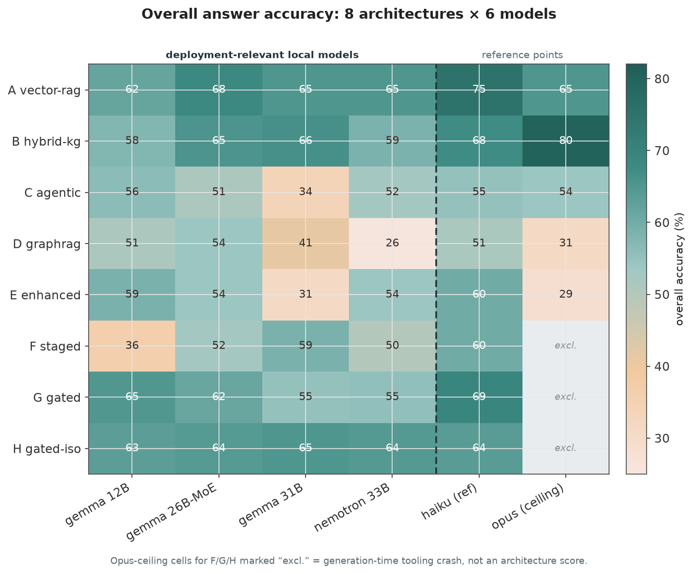
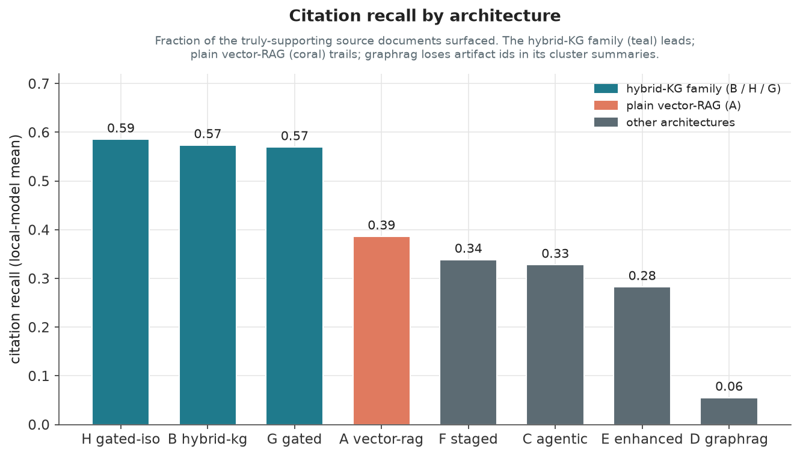
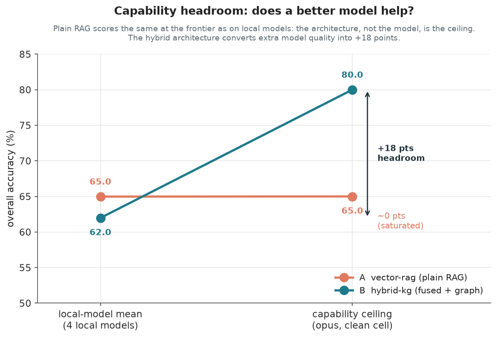
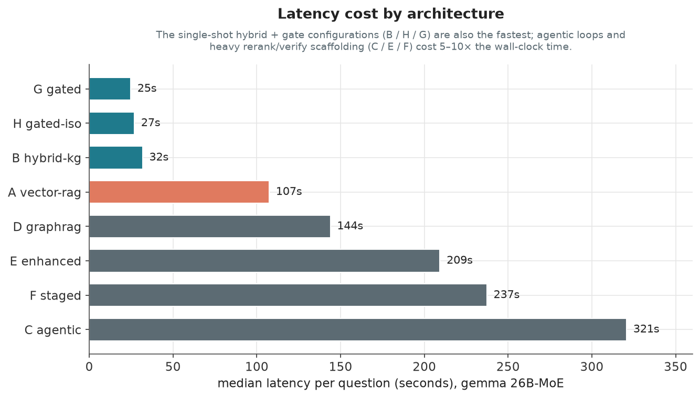

# Retrieval architecture bake-off: which design actually works for a knowledge-graph-backed engineering assistant?

*A controlled study of eight retrieval architectures across six language models, on a
synthetic engineering corpus, graded by an LLM judge. All data here comes from a fully
fictional test corpus (the Kestrel K-200 survey drone by Meridian Dynamics); no real
product, company, or person appears anywhere in the study.*

---

## 1. What this is, in one paragraph

We wanted to answer a practical question before committing to a build: **for an
engineering knowledge assistant that has to run on small, on-premises language models,
which retrieval architecture is actually worth the complexity?** "Retrieval architecture"
here means the machinery that sits between a user's question and the model's answer:
what it searches, how it ranks and fuses evidence, whether it walks a knowledge graph,
whether it loops, and how it decides when to decline. We built a lab, generated a
760-artifact synthetic corpus with a graded 40-question exam, implemented eight
architectures from a plain baseline up to elaborate composed designs, ran every one of
them across six models, and had a blind LLM judge score every answer. This note reports
what we found. It deliberately does **not** crown a single winner. The finding that
matters is that the right architecture depends on the shape of your data and your
tolerance for wrong answers, and now we have the evidence to choose per project rather
than guess.

Acronyms used once and then freely: **RAG** (retrieval-augmented generation, the standard
"search the corpus, stuff the hits into the prompt, let the model answer" pattern);
**BM25** (a classic keyword-ranking function, good at exact ids and rare terms where
embeddings are weak); **KG** (knowledge graph); **RRF** (reciprocal-rank fusion, a simple
way to merge several ranked lists into one); **MoE** (mixture-of-experts, a model that
activates only a fraction of its parameters per token).

---

## 2. How the bake-off was run

### 2.1 The corpus

A realistic engineering knowledge estate is not a pile of documents. It is a web of
cross-referenced artifacts: parts and their bill-of-materials, change notices, controlled
documents, issue-tracker tickets, wiki pages, drawing notes, review records, and source
modules, all pointing at each other, and all authored by people, some of whom have since
left. We synthesised exactly that: roughly 760 cross-referenced artifacts (about 180 parts
plus an engineering bill of materials, 70 change notices, 90 documents, 220 issue-tracker
tickets, 80 wiki pages, 30 code modules, 40 drawing notes, 50 review records) authored by
14 fictional engineers, two of whom "left the company" so we could probe the
tribal-knowledge failure mode. Every reference resolves; there are no broken links.

On top of that base we planted **25 multi-hop trails**: decision-provenance chains ("why
was this decision made, and what evidence backs it?"), dependency chains, impact fan-outs
("if this changes, what else moves?"), and tribal-knowledge traps where the answer lives
in a departed engineer's notes. These trails are what separate a corpus you can answer
with a single lucky chunk from one that demands real retrieval.

### 2.2 The exam

We wrote a 40-question graded gold set spanning five categories, chosen to stress
different capabilities:

| Category | Count | What it tests |
|---|---|---|
| **Provenance** | 10 | Trace a decision or value back to its authoritative source. |
| **Dependency** | 10 | Follow a chain of "A depends on B depends on C". |
| **Impact** | 10 | Fan out from a change to everything it affects. |
| **Lookup** | 5 | Retrieve a specific fact or exact id. |
| **Negative** | 5 | Questions that are deliberately unanswerable from the corpus, to see whether an architecture invents an answer or declines honestly. |

The negative category is the one most benchmarks omit and the one that matters most for a
trust-sensitive deployment. An architecture that scores well on the first four categories
but confidently answers the five unanswerable questions is worse than useless in a setting
where an operator will act on what it says.

### 2.3 The runner and the judge

Generation and grading were separated. A resumable runner executes every
architecture-by-model cell, writes each answer to a per-cell log
(`raw-{arch}-{model}.jsonl`), and can re-run a single cell without touching the rest, which
matters when one cell fails and you do not want to regenerate 40 hours of work. Grading is
done by a blind LLM judge (a frontier model) that scores each answer **0 / 1 / 2** against
a gold answer, never seeing which architecture produced it. On top of the judge's quality
score we compute, deterministically, a **hallucination flag** and **citation
precision/recall** by comparing the ids the answer cited against the ids that genuinely
support the gold answer.

### 2.4 Metrics captured

For every cell we record: **overall %** (the judge's 0/1/2 scaled to 0 to 100, meaned over
graded rows), the same broken out **per category**, **hallucination rate**, **citation
recall** (of the documents that truly support the answer, what fraction did the system
surface?), **median latency per question**, and an **error count** (questions that failed
at generation time and were excluded rather than scored zero). Overall % tells you how
often it was right; citation recall tells you whether it can show its work; the negative
category and hallucination rate tell you whether you can trust it when it is out of its
depth.

---

## 3. The eight architectures, as a narrative

The point of running eight architectures was not to sample the design space at random. Each
one was built to fix a specific weakness in the ones before it. Read in order, they tell a
story about what small models do and do not need.

**A: vector-rag (the control).** The textbook baseline: chunk the corpus, embed the
chunks, retrieve the top-k by vector similarity, answer. No keyword search, no graph, no
reranking. This is the floor every other architecture has to clear. *Weakness it exposes:*
pure vector similarity misses exact ids and rare tokens (a part number is a lousy thing to
match by semantic similarity), and it has no notion of structure, so "what depends on X" is
a guess. *What we learned:* a competent plain-RAG baseline is surprisingly hard to beat on
raw accuracy with a small model, and it is the most consistent design across models. It is a
standing reminder not to over-engineer.

**B: hybrid-kg (fused retrieval plus a knowledge graph).** The first real design.
It addresses A's two weaknesses directly: it adds **BM25 keyword search** (which catches the
exact ids vectors miss) and a **knowledge-graph hop** (which turns cross-references into
traversable edges), then fuses vector, keyword, and graph results with reciprocal-rank
fusion. *Benefit materialised?* Decisively on the metric that matters for traceability: B
retrieves roughly **1.5 times** the correct supporting citations of plain RAG, and it is the
only family that can treat "what is affected if I change X" as a graph traversal rather than
a semantic guess. *What we learned:* fusing complementary retrievers is the single highest-
leverage move in the whole study. Its one weakness is that the extra context can crowd a very
small model, which is visible in B's 12B cell trailing its larger-model cells.

**C: agentic (a reasoning-and-tool loop).** B still does retrieval in one shot. C asks:
what if the model could *decide* what to retrieve, iterating, in a ReAct-style loop with
search, graph, and read tools, until it is satisfied? *Weakness it targets:* single-shot
retrieval can miss when the right query is not obvious up front. *Benefit materialised?* No,
not at this model scale. C nails exact-id lookups in a couple of iterations but **thrashes**
on enumeration and multi-hop questions, burning its iteration cap and running three to five
minutes per question on the gemma models. Its citations are weak because it often answers
from search snippets rather than opening the source. *What we learned:* the tool-loop
scaffolding is a net tax on 12B-to-33B models. They do not reliably plan their own retrieval;
they wander.

**D: graphrag (community summarisation).** A different bet: a Microsoft-GraphRAG-style
design that detects communities in the graph and pre-summarises each cluster, so the model
reasons over tidy thematic summaries rather than raw artifacts. *Weakness it targets:*
open-ended, "zoom out and tell me about this area" questions that no single chunk answers.
*Benefit materialised?* Partially, and with a fatal catch. D handles thematic questions well
and declines cleanly on negatives, but its citation recall is **near zero (0.005 to 0.12)**:
the community summaries dissolve the individual artifact ids, so it cannot tell you *which*
document to check. For a trust-but-verify system that is disqualifying, however clean its
refusals are. *What we learned:* summarisation that loses provenance is the wrong trade for
this job.

**E: enhanced (rerank plus verify plus vote).** The heavy-scaffolding hypothesis: take the
agentic loop and pile on a cross-encoder reranker, a verification pass, and self-consistency
voting across multiple samples. *Weakness it targets:* small-model noise, the theory being
that more passes clean up more mistakes. *Benefit materialised?* No. It helped in early
rounds but in the full matrix the tax outweighs the benefit on most cells, at roughly eight
minutes per question. *What we learned:* stacking mitigations is not free. Past a point each
new pass costs more accuracy (through added failure surface) and far more latency than it
returns. This was the clearest "stop adding machinery" signal in the study.

**F: staged (compose the winners).** The first attempt to combine what worked: run B first,
and only escalate to an agent loop when a self-verification step says the answer looks weak;
precompute impact closures; let the model gate its own output. *Weakness it targets:* using
the expensive agentic path only when the cheap path is insufficient. *Benefit materialised?*
It backfired on small models, badly. The design let the **generation model verify its own
answer**, and small models, acting as their own judge, decline far too often: the 12B cell
logged around 29 false refusals against only 5 true negatives, sinking it to 36%. *What we
learned:* never let a nervous small model be the arbiter of its own correctness. This lesson
is the direct parent of G.

**G: gated (a deterministic evidence gate).** F's fix. Remove the model from the
answer-versus-decline decision entirely and replace it with a **deterministic** gate: pure
retrieval maths, no model call, computed before generation, deciding whether the retrieved
evidence is sufficient to answer. Alongside the gate, G also bundled impact closures and
provenance reweighting. *Benefit materialised?* The targeted win landed: best-in-class
provenance and negative-question handling with **zero false refusals**, good citations, and
low latency. But because G changed four things at once, when it settled mid-pack we could not
attribute the shortfall to any one of them, and two regressions appeared (dependency
questions dropped as closure documents crowded out raw chain evidence, and hallucination
ticked up on the gemma models). *What we learned:* a deterministic rule beats a self-judging
model for the refuse-or-answer decision, but bundling changes destroys your ability to
measure them.

**H: gated-isolated (the clean experiment).** H is G's lesson applied: take **unmodified B,
add only G's deterministic gate, change nothing else.** Retrieval is byte-for-byte identical
to B (verified: zero of 40 questions differ in retrieved ids), so any difference is
attributable to the gate alone. *Result:* the gate is essentially **free**. H matches or
slightly beats B on overall accuracy, keeps B's citation lead, adds clean negative handling
and a cheap, quota-proof decline path, and carries none of G's regressions. *What we learned:*
isolate one change at a time. H is the reason we can say with confidence that a deterministic
gate buys safety at no accuracy cost, a claim G's bundled numbers could never have supported.

---

## 4. The results

### 4.1 Overall accuracy across the full grid



The heatmap is the whole study on one page. Rows are architectures A to H, columns are models
(the four local, deployment-relevant models on the left of the dashed divider, the two
reference models on the right). A few things jump out:

- The **hybrid and gated family (B, G, H)** and the **plain-RAG control (A)** occupy the top
  band on the local models. They cluster tightly, in the low-to-mid 60s.
- The **elaborate designs (C, D, E)** are a clear tier lower, and get *worse*, not better, on
  the larger local models, the opposite of what you would want.
- The three **"excl." cells** (F, G, H at the Opus ceiling) are not scores. They are a
  generation-time tooling crash (the frontier backend hit repeated failures and returned empty
  answers, which the judge scored zero). We exclude them rather than let a tooling failure
  masquerade as an architecture result. Every deployment-relevant local cell graded cleanly
  with zero errors, so the decision-relevant data is intact.

On the single overall-% column, plain RAG (A) is marginally ahead on the local models (a
local mean of 65.0 versus 62.0 for B and 64.2 for the H configuration). We say that plainly.
It is also not the number to decide on, for the reasons the next three charts make visible.

### 4.2 Citation recall: can it show its work?



For a trust-but-verify assistant, where the operator reads the answer and then checks the
cited sources, **citation recall is the load-bearing metric**: did the system point you at the
documents that actually contain the answer? Here the picture is not close. The hybrid-KG family
(H, B, G) surfaces roughly **0.57 to 0.59** of the correct citations on local models; plain RAG
manages **0.39**. That is about **1.5 times more** of the right sources on the same questions.
graphrag (D) collapses to 0.06 because its cluster summaries discard the artifact ids. A design
that is a few points lower on a fuzzy accuracy score but points you at the right document half
again as often is the better instrument for a job where a human verifies every answer.

### 4.3 Capability headroom: does a better model help?



This is the most important chart in the study, and it rests on the two cells that graded
perfectly cleanly at the frontier ceiling: plain RAG (A) and hybrid-KG (B). It plots, for each,
the mean of the four local models against the clean frontier-ceiling score.

**Plain RAG is capability-saturated.** Its frontier-ceiling score (65.0) is the *same* as its
local-model mean (65.0). Throwing a vastly more capable model at it changes nothing, because the
*architecture*, not the model, is the bottleneck. The hybrid architecture behaves in the
opposite way: same corpus, same questions, but the frontier model reaches **80.0**, **+18 points**
of headroom. Only the hybrid design converts extra model quality into better answers. In a
setting where hardware and model size are expected to improve over time, that difference decides
whether future investment in a bigger model pays off or is wasted. This is the single strongest
argument for a knowledge-graph-backed architecture over plain RAG, and it is invisible if you
look only at today's local-model accuracy.

### 4.4 Latency: what does the machinery cost?



The single-shot hybrid-and-gate configurations (B, H, G) are not only competitive on accuracy
and ahead on citations, they are also the **fastest**, at roughly 25 to 32 seconds per question
on the recommended local model. The elaborate designs pay for their machinery in wall-clock time:
the agentic loop (C) runs over five minutes per question, and the heavy rerank-verify-vote stack
(E) and staged escalation (F) are little better. Latency is not a tie-breaker here; it points the
same way as everything else. The scaffolding that hurt accuracy also cost the most time.

---

## 5. The models

Six models were tested. Four are the deployment-relevant, locally-runnable options; two are
reference points only. Embeddings were always computed by a local embedder, so the "nothing
leaves site" property holds regardless of which answer model is used.

| Model | Class | What it showed |
|---|---|---|
| **gemma 12B** | Local, small | A usable floor. Fast, but it **crowds** on the heavy-context architectures: it trails the larger models specifically where retrieval dumps a lot of context into the prompt (B's 12B cell is its weakest). |
| **gemma 26B-MoE** | Local, mixture-of-experts | The **best value** of the four. It matches or beats the dense 31B on accuracy while running many times faster, because only about 3.8B of its parameters are active per token and it fits in a single mid-size GPU without a CPU-offload penalty. Best local provenance score in the study. |
| **gemma 31B (dense)** | Local, large | Marginally higher raw accuracy on some cells, at **6 to 14 times the latency** (around 5.5 minutes per question, hurt by partial CPU offload on a 16GB card). No accuracy gain that justifies the latency. |
| **nemotron 33B** | Local, large | **Fast but erratic.** Quick to respond, but swings hard by category and collapsed on graphrag (25.6). Too inconsistent to trust as a sole resident model. |
| **haiku-class proxy** | Reference (API) | A capable mid-tier cloud model, included as a "what would a small hosted model do" reference. Consistently solid, not the point of the study. |
| **Opus-class ceiling** | Reference (API) | The "unlimited model quality" line. The clean A and B ceiling cells are what the headroom argument (Section 4.3) rests on. |

The headline model insight is the same one the headroom chart makes at the architecture level,
seen now from the model side: **more capable models only help if the architecture can use them.**
A mixture-of-experts model in the 26B class is the sweet spot for a local deployment, giving you
most of the accuracy of the largest local model at a fraction of the latency, and it is the model
on which the hybrid architecture's headroom starts to pay off.

---

## 6. What we now know: choosing an architecture per project

The strongest and most useful finding of the whole exercise is that **there is no single best
architecture, only architecture-to-problem fit.** The ranking *inverts* between frontier and
small models: big models are happiest with simple retrieval, small models need some help but far
less than we assumed (the heaviest scaffolding, E, mostly hurt). That means the right question is
never "which architecture wins" but "which architecture fits *this* corpus and *this* tolerance
for error." The evidence gives a clear decision guide:

- **The corpus is simple and lookup-shaped (facts, definitions, flat documents), and occasional
  misses are tolerable.** Plain vector RAG (A) is genuinely fine, and often the right call. It is
  consistent, cheap to build, and hard to beat on raw accuracy at small scale. Do not add
  machinery it will not use. Its ceiling is low and fixed, so only pick it if you do not expect to
  need the headroom later.

- **The work is audit-heavy and every answer will be human-verified against its sources.** A
  citation-first hybrid design (fused vector plus keyword plus knowledge graph, the B family) is
  the right instrument. It surfaces about 1.5 times the correct sources of plain RAG, which is the
  metric that actually governs how fast a human can verify an answer.

- **The valuable questions are graph-shaped: dependency and impact ("if I change X, what is
  affected?").** These are structurally beyond plain RAG, which can only guess at them, and they
  are the weakest category across the entire matrix for every architecture. A knowledge-graph
  backbone turns them into traversals. If these questions are why you are building the system, the
  KG is not optional.

- **Wrong answers are expensive and honest refusals are cheap (safety-critical or
  trust-sensitive settings).** Add the deterministic evidence gate (the H configuration). The
  isolated experiment showed it costs essentially nothing in accuracy while eliminating the
  false-refusal failure mode and giving a quota-proof, model-free "not in the corpus" path. It is
  a safety and honesty mechanism, not an accuracy booster, and in the right setting that is
  exactly what you want.

- **You expect model quality or hardware to improve over the system's life.** Favour the hybrid
  architecture regardless of today's local-model scores, because it is the only design with
  headroom. Plain RAG will not reward a future upgrade; the hybrid design will.

Some things are simply *not* worth it at this model scale, and the study is unambiguous about
them: agentic tool-loops (C) thrash and are slow on 12B-to-33B models; always-on
rerank-verify-vote stacks (E) tax accuracy and latency more than they help; summarisation-based
graphrag (D) throws away the provenance a verifiable system depends on; and letting a small model
judge its own answers (F) makes it refuse itself out of contention. None of these are bad ideas in
the abstract. They are bad fits for small local models, and the numbers show it clearly enough
that we do not need to relitigate them per project.

---

## 7. A reference implementation of the composable pieces

The value of this study is not a verdict to copy; it is a set of **composable building blocks**
whose individual costs and benefits we have now measured: **fused hybrid retrieval** (vector plus
keyword plus graph, RRF-combined), a **knowledge-graph backbone** (best built on a structured
hierarchy such as a parts or assembly tree, with documents hung off the entities they describe,
so impact and dependency become traversals rather than guesses), and a **deterministic evidence
gate** (the answer / borderline / decline decision computed from retrieval maths, never from the
model judging itself).

The repository this document lives in, **Hybrid-Data-Example**, is a clean-room, dependency-light
implementation of exactly those pieces, assembled so they can be taken apart. It runs entirely
offline for tests and the demo (one SQLite file, no external services, no GPU), and swaps to a
real local stack (a gemma-class answer model plus a local embedder) for a production run. Teaching
it a new data source is a small adapter, usually under 50 lines. So the way to use this research is
not "deploy architecture X". It is: look at your corpus and your error tolerance, use Section 6 to
decide which of these blocks you actually need, and assemble them from the reference implementation
for the project in front of you. That is the whole point of having run the bake-off: to be able to
choose deliberately, with evidence, instead of reaching for whichever architecture is fashionable.

---

## Appendix: the full results matrix

Overall % is the graded-row mean (LLM judge, 0/1/2 scaled to 0 to 100). Citation recall and
hallucination rate are deterministic. Latency is the median per question. **Local-model rows
(gemma / nemotron) are the deployment-relevant cells and all graded with zero errors.** Reference
rows are context. Cells marked *excluded (crash)* failed at generation time (empty answers from a
tooling failure) and are not architecture scores; a handful of other frontier and dense-31B cells
lost some questions to the same class of failure and are marked *soft*.

| Arch | Model | Overall % | Prov | Dep | Impact | Lookup | Neg | Halluc | Cit recall | Median ms | Errs |
|---|---|---|---|---|---|---|---|---|---|---|---|
| A vector-rag | gemma 12B | 61.7 | 65.0 | 50.0 | 50.0 | 50.0 | 100.0 | 0.30 | 0.389 | 65,157 | 0 |
| A vector-rag | gemma 26B-MoE | 68.3 | 66.7 | 70.0 | 50.0 | 75.0 | 90.0 | 0.20 | 0.399 | 107,350 | 0 |
| A vector-rag | gemma 31B | 65.0 | 75.0 | 55.0 | 50.0 | 60.0 | 100.0 | 0.30 | 0.389 | 284,054 | 0 |
| A vector-rag | nemotron 33B | 64.9 | 75.0 | 50.0 | 50.0 | 60.0 | 100.0 | 0.38 | 0.368 | 20,007 | 0 |
| A vector-rag | haiku (ref) | 75.0 | 85.0 | 65.0 | 55.0 | 90.0 | 100.0 | 0.50 | 0.474 | 19,579 | 0 |
| A vector-rag | opus (ceiling) | 65.0 | 70.0 | 50.0 | 60.0 | 60.0 | 100.0 | 0.55 | 0.507 | 16,832 | 0 |
| **B hybrid-kg** | gemma 12B | 57.7 | 60.0 | 55.6 | 40.0 | 70.0 | 80.0 | 0.49 | 0.553 | 61,387 | 0 |
| **B hybrid-kg** | gemma 26B-MoE | 65.4 | 80.0 | 45.0 | 55.6 | 60.0 | 100.0 | 0.49 | 0.626 | 31,799 | 0 |
| **B hybrid-kg** | gemma 31B | 66.2 | 65.0 | 60.0 | 55.0 | 70.0 | 100.0 | 0.35 | 0.537 | 324,758 | 0 |
| **B hybrid-kg** | nemotron 33B | 58.6 | 60.0 | 41.7 | 44.4 | 80.0 | 80.0 | 0.43 | 0.579 | 25,805 | 0 |
| **B hybrid-kg** | haiku (ref) | 67.5 | 90.0 | 50.0 | 50.0 | 80.0 | 80.0 | 0.75 | 0.835 | 21,636 | 0 |
| **B hybrid-kg** | opus (ceiling) | 80.0 | 90.0 | 65.0 | 70.0 | 90.0 | 100.0 | 0.50 | 0.871 | 25,773 | 0 |
| C agentic | gemma 12B | 56.2 | 70.0 | 35.0 | 50.0 | 60.0 | 80.0 | 0.35 | 0.352 | 234,177 | 0 |
| C agentic | gemma 26B-MoE | 51.2 | 65.0 | 25.0 | 35.0 | 60.0 | 100.0 | 0.23 | 0.416 | 320,697 | 0 |
| C agentic | gemma 31B *(soft)* | 33.8 | 60.0 | 15.0 | 25.0 | 70.0 | 0.0 | 0.20 | 0.260 | 151,671 | 17 |
| C agentic | nemotron 33B | 52.5 | 60.0 | 40.0 | 45.0 | 60.0 | 70.0 | 0.50 | 0.284 | 45,819 | 0 |
| C agentic | haiku (ref) | 55.0 | 65.0 | 40.0 | 35.0 | 80.0 | 80.0 | 0.50 | 0.376 | 44,368 | 0 |
| C agentic | opus (ceiling) *(soft)* | 53.8 | 80.0 | 60.0 | 50.0 | 50.0 | 0.0 | 0.57 | 0.337 | 70,904 | 6 |
| D graphrag | gemma 12B | 51.2 | 35.0 | 40.0 | 60.0 | 40.0 | 100.0 | 0.05 | 0.071 | 88,284 | 0 |
| D graphrag | gemma 26B-MoE | 53.8 | 60.0 | 20.0 | 55.0 | 62.5 | 100.0 | 0.03 | 0.029 | 143,923 | 0 |
| D graphrag | gemma 31B | 41.2 | 35.0 | 20.0 | 45.0 | 30.0 | 100.0 | 0.15 | 0.116 | 435,798 | 0 |
| D graphrag | nemotron 33B | 25.6 | 20.0 | 33.3 | 10.0 | 40.0 | 40.0 | 0.47 | 0.005 | 27,062 | 0 |
| D graphrag | haiku (ref) | 51.4 | 50.0 | 75.0 | 35.0 | 40.0 | – | 0.40 | 0.379 | 55,398 | 0 |
| D graphrag | opus (ceiling) *(soft)* | 31.2 | 0.0 | 10.0 | 25.0 | 80.0 | 100.0 | 0.10 | 0.162 | 45,906 | 12 |
| E enhanced | gemma 12B | 58.8 | 60.0 | 45.0 | 45.0 | 70.0 | 100.0 | 0.38 | 0.357 | 208,697 | 0 |
| E enhanced | gemma 26B-MoE | 53.8 | 70.0 | 20.0 | 45.0 | 70.0 | 90.0 | 0.33 | 0.346 | 209,329 | 0 |
| E enhanced | gemma 31B *(soft)* | 30.8 | 70.0 | 5.0 | 10.0 | 70.0 | 0.0 | 0.20 | 0.216 | – | 22 |
| E enhanced | nemotron 33B | 53.8 | 65.0 | 25.0 | 40.0 | 70.0 | 100.0 | 0.25 | 0.211 | 85,935 | 0 |
| E enhanced | haiku (ref) | 60.0 | 65.0 | 60.0 | 40.0 | 70.0 | 80.0 | 0.55 | 0.372 | 150,376 | 0 |
| E enhanced | opus (ceiling) *(soft)* | 28.7 | 70.0 | 45.0 | 0.0 | 0.0 | 0.0 | 0.25 | 0.189 | 90,595 | 22 |
| F staged | gemma 12B | 36.2 | 30.0 | 25.0 | 10.0 | 60.0 | 100.0 | 0.05 | 0.199 | 52,261 | 0 |
| F staged | gemma 26B-MoE | 52.5 | 65.0 | 25.0 | 40.0 | 60.0 | 100.0 | 0.20 | 0.361 | 237,314 | 0 |
| F staged | gemma 31B | 58.8 | 70.0 | 30.0 | 45.0 | 80.0 | 100.0 | 0.33 | 0.440 | 721,144 | 0 |
| F staged | nemotron 33B | 50.0 | 60.0 | 30.0 | 35.0 | 70.0 | 80.0 | 0.25 | 0.354 | 168,821 | 0 |
| F staged | haiku (ref) | 60.0 | 65.0 | 55.0 | 50.0 | 70.0 | 70.0 | 0.68 | 0.463 | 100,345 | 0 |
| F staged | opus (ceiling) | *excluded (crash)* | – | – | – | – | – | – | – | – | 18 |
| **G gated** | gemma 12B | 64.7 | 60.0 | 60.0 | 55.6 | 60.0 | 100.0 | 0.44 | 0.551 | 59,246 | 0 |
| **G gated** | gemma 26B-MoE | 61.5 | 75.0 | 44.4 | 40.0 | 70.0 | 100.0 | 0.49 | 0.632 | 24,680 | 0 |
| **G gated** | gemma 31B | 55.0 | 50.0 | 50.0 | 50.0 | 60.0 | 80.0 | 0.45 | 0.497 | 278,669 | 0 |
| **G gated** | nemotron 33B | 55.4 | 60.0 | 28.6 | 45.0 | 80.0 | 80.0 | 0.51 | 0.598 | 26,273 | 0 |
| **G gated** | haiku (ref) | 69.2 | 80.0 | 50.0 | 61.1 | 70.0 | 100.0 | 0.60 | 0.825 | 21,322 | 0 |
| **G gated** | opus (ceiling) | *excluded (crash)* | – | – | – | – | – | – | – | – | 40 |
| **H gated-iso** | gemma 12B | 63.2 | 70.0 | 50.0 | 50.0 | 80.0 | 80.0 | 0.53 | 0.528 | 46,400 | 0 |
| **H gated-iso** | gemma 26B-MoE | 64.1 | 75.0 | 50.0 | 50.0 | 80.0 | 80.0 | 0.41 | 0.659 | 26,922 | 0 |
| **H gated-iso** | gemma 31B | 65.0 | 70.0 | 50.0 | 60.0 | 60.0 | 100.0 | 0.53 | 0.573 | 346,030 | 0 |
| **H gated-iso** | nemotron 33B | 64.3 | 65.0 | 50.0 | 50.0 | 75.0 | 100.0 | 0.37 | 0.582 | 36,137 | 0 |
| **H gated-iso** | haiku (ref) | 63.7 | 75.0 | 55.0 | 50.0 | 70.0 | 80.0 | 0.75 | 0.846 | 20,494 | 0 |
| **H gated-iso** | opus (ceiling) | *excluded (crash)* | – | – | – | – | – | – | – | – | 40 |

### Local-model summary (mean of the four local models)

| Architecture | Local mean overall % | Local citation recall (range) |
|---|---|---|
| A vector-rag | 65.0 | 0.37 – 0.40 |
| H gated-iso (B + gate) | 64.2 | 0.53 – 0.66 |
| B hybrid-kg | 62.0 | 0.54 – 0.63 |
| G gated | 59.2 | 0.50 – 0.63 |
| F staged | 49.4 | 0.20 – 0.44 |
| E enhanced | 49.3 *(31B cell soft)* | 0.21 – 0.36 |
| C agentic | 48.4 *(31B cell soft)* | 0.28 – 0.42 |
| D graphrag | 43.0 | 0.01 – 0.12 |

### Reproducing and regenerating

The charts in this document are generated from the matrix above by
[`research-assets/make_charts.py`](research-assets/make_charts.py). Run it with the repository
virtual environment:

```bash
.venv/bin/python docs/research-assets/make_charts.py
```

For how the reference implementation runs its own offline evaluation, see
[`docs/evaluation.md`](evaluation.md); for the architecture of the composable pieces, see
[`docs/architecture.md`](architecture.md).
