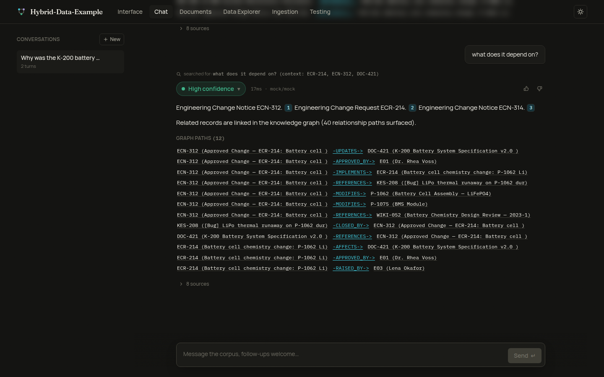
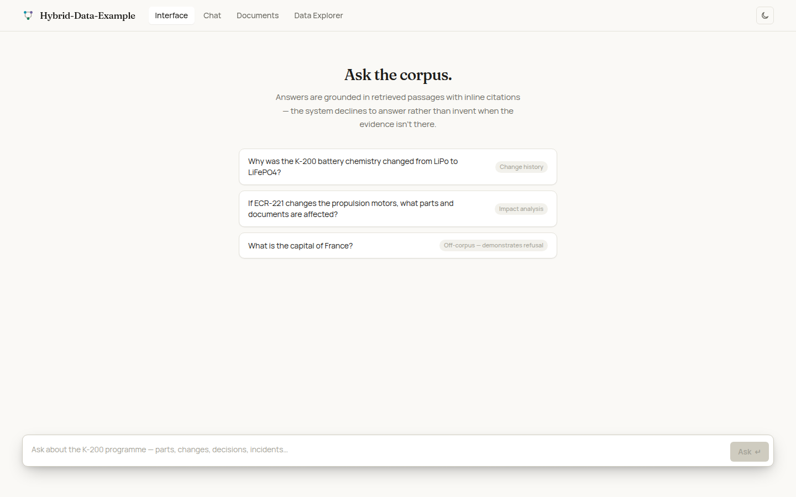

# Multi-turn Chat

The **Chat** tab adds server-side conversations with follow-up questions on top
of the single-shot ask pipeline. The design goal is continuity **without
sacrificing accuracy**: every turn goes through the exact same fused retrieval
and deterministic evidence gate as the Interface tab, so a follow-up can never
be answered from chat history alone.



## Per-turn pipeline

```
user message + recent history
        |
        v
  1. CONDENSE   rewrite into one standalone question (query rewriting)
        |
        v
  2. RETRIEVE   fresh fused retrieval (vector + BM25 + graph + exact-id)
        |            against the REWRITTEN question, every turn
        v
  3. GATE       deterministic evidence gate, every turn
        |            insufficient -> per-turn refusal, exactly like Interface
        v
  4. SYNTHESIZE grounded answer with citations; the prompt additionally
                carries a BOUNDED history window, for continuity only
```

### 1. Condensation (query rewriting)

A follow-up like *"what does it depend on?"* is useless as a retrieval query.
Each turn the newest message plus the recent history window is condensed into
one standalone question, which is what retrieval, the gate, and telemetry all
see. The rewritten question is exposed in the turn payload and shown in the UI
as a subtle "searched for: ..." line, so the behaviour is never hidden.

* A message that is already standalone (names a record id, or is a full
  question with no reference words like *it / that / them*) passes through
  untouched (`rewrite_method: "raw"`).
* With a real backend (`ollama` / `anthropic`) the rewrite is produced by the
  configured answer model, time-boxed by `chat.condense_timeout_s`. On timeout
  or any failure the raw message is used as-is: the fallback is safe because
  the same fresh retrieval and gate still run on whatever question is used.
* With the **mock** backend the rewrite is deterministic (the follow-up is
  anchored to the record ids the previous turn cited), so the offline demo,
  unit tests, and e2e runs are stable with no model call.

### 2 + 3. Fresh retrieval and the gate, every turn

There is no "answer from memory" path. The rewritten question runs through
`retrieve()` and `gate.evaluate()` per turn; an off-corpus follow-up in the
middle of a conversation gets the same honest "not in the corpus" refusal (and
closest-matches panel) as the Interface tab, and the conversation carries on
afterwards. Confidence surfacing is identical: the verdict pill is backed by
the real gate signals for that turn.

### 4. Grounded synthesis with a bounded history window

The synthesis prompt receives the rewritten question, the retrieved passages,
and a **bounded window** of prior turns, clearly framed as *context only*: the
model is instructed to ground every claim in the retrieved passages and cite
them, never the history. Citations resolve to exact passage spans exactly like
the ask path.

The window is bounded twice, per `[chat]` config:

| knob | default | meaning |
|---|---|---|
| `history_turns` | 6 | last N completed turns considered |
| `history_char_budget` | 6000 | total character cap on the rendered window (per-turn answers are clipped first; the newest turn is always kept) |
| `condense_timeout_s` | 20 | hard time-box on the LLM rewrite |

Env-var equivalents: `HDE_CHAT_HISTORY_TURNS`, `HDE_CHAT_HISTORY_CHAR_BUDGET`,
`HDE_CHAT_CONDENSE_TIMEOUT_S` (defaults < config file < env, as everywhere).

## Persistence

Conversations live in the **telemetry database** (writable, survives corpus
rebuilds; the corpus store stays read-only): `chat_conversations` plus
`chat_turns`, created with the same `CREATE TABLE IF NOT EXISTS` + `_migrate()`
pattern as the rest of telemetry, so pre-chat volumes upgrade cleanly on first
open. Each turn also logs a normal `asks` row, which is what System health and
thumbs feedback key on; the `chat_turns` row stores the raw message, the
rewrite (+ method), the cited ids, and the full result payload so the UI can
reload a thread with citations and sources intact.

## Endpoints

See [api.md](api.md#multi-turn-chat-conversations) for the full contract:
`POST/GET /api/chat/conversations`, `GET/PATCH/DELETE
/api/chat/conversations/{id}`, and `POST /api/chat/conversations/{id}/messages`
(+ `/stream` for the SSE variant, which mirrors `/api/ask/stream` with an extra
leading `rewrite` event).

Failure behaviour is per-turn: if the answer model is unreachable the blocking
endpoint returns a clean 502 and the stream emits an `error` event; the failed
turn is recorded with `status: "error"` and the conversation stays usable. The
engine lock is never held across the model stream (same discipline as the ask
path), so a slow model or an abandoned stream cannot wedge the engine.

## Per-tab enablement: `[ui.tabs]`

Deployments can switch individual tabs off. Each key defaults to `true`:

```toml
[ui.tabs]
# interface = true      # single-shot Q&A page
# chat = true           # multi-turn conversations
# documents = true
# explorer = true
ingestion = false       # example: hide corpus management
testing = false         # example: hide the golden-set page
```

Env override per tab: `HDE_UI_TAB_<NAME>=0|1` (e.g. `HDE_UI_TAB_TESTING=0`).
The resolved map is served in `GET /api/corpus/meta` as `tabs`; the frontend
hides disabled tabs from the navigation **and** guards their routes: a deep
link to a disabled tab redirects to the first enabled tab in nav order. An
older backend that omits `tabs` behaves as all-enabled.


